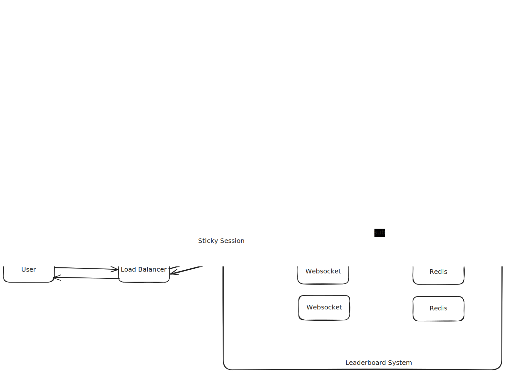
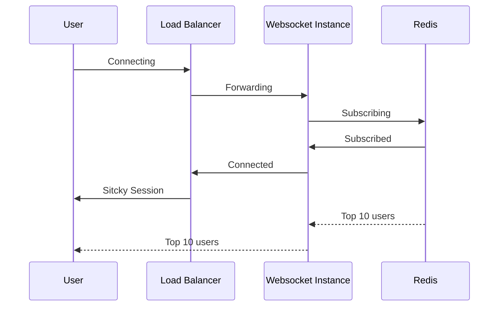

# leaderboard

> A scoring system that displays scores and serves as a leaderboard

## Challenge

### Description

- A leaderboard should display the current standings of all participants.
- The leaderboard should update promptly as scores change.
- A leaderboard should display the current standings of all participants in real-time.

## Estimation and Assumption

### Traffic

**Now:**

- The app has approximately 50 million downloads, and let's say 10% of them are DAU, which equals 5 million DAU.
- Five million DAU translates to an average of **60 RPS** (requests per second). During peak periods, we can expect 10x the RPS, reaching **600 RPS**.

**Future:**

- Assuming a 30% growth rate, after three years we will have 10 million DAU.
- This translates to **115 RPS** (requests per second) on average and **1150 RPS** during peak periods.

### Storage

A leaderboard structure contains the following fields:

- Username: string, 26 bytes
- Score: integer, 2 bytes

Other user information will be stored separately and cached for optimal performance. We will retrieve this information later when we have a list of user IDs from the leaderboard. This approach ensures the leaderboard remains as small as possible.

Assuming we need to serve 1000 leaderboards with 1000 records per leaderboard for daily, weekly, monthly, and yearly durations, we require storage for:
1000 \* 1000 \* 4 = 4,000,000 records.

Thus, the storage required is:
4,000,000 \* 28 bytes ~ **112 MB of RAM**.

### Connections

It's worth worrying about connections because real-time communication requires active connections to maintain client-server interaction. I assume that one server with **2 vCPU** and **8GB RAM** can handle **3000 connections**.

This means one server can efficiently serve the leaderboard. However, for high availability, we need to distribute the load across multiple servers. In this case, sticky sessions will also be required to ensure consistent client-server communication.

## System Design Documents

### Architecture Diagram

### Component Descriptions

The Leaderboard system can be designed in several ways: hosted on Kubernetes, ECS on AWS, or on-premise. However, due to time constraints, I will use Docker with docker-compose to deploy the infrastructure. If time allows, we can later migrate to Kubernetes.

The system contains three critical components:

- Load Balancer

  - Handles request routing for WebSocket connections.
  - It MUST support sticky sessions to maintain consistent connections.
  - With the docker-compose setup, a load balancer is not necessary because we can connect directly to the WebSocket instance.

- WebSocket Instances

  - Developed in Node.js using the Socket.io library for real-time communication.

- Redis instances: Stores leaderboard data.

  - It MUST support sharding and replica sets to ensure high availability in production.
  - Redis also serves as the backplane for WebSocket connections.

Other components that are omitted to simplify the design include:

- Metadata Service

  - Stores user profiles, such as name, avatar, etc.
  - This service MUST cache user information to improve performance.

### Data Flow

### Technology Justification

- Any load balancer that supports sticky session
- Websocket for real-time connection
- Redis as a database for leaderboard, message broker and backplane of websocket
- NodeJS for backend
- HTML/CSS/JS for frontend
- OpenTelemetry for monitoring and tracing
